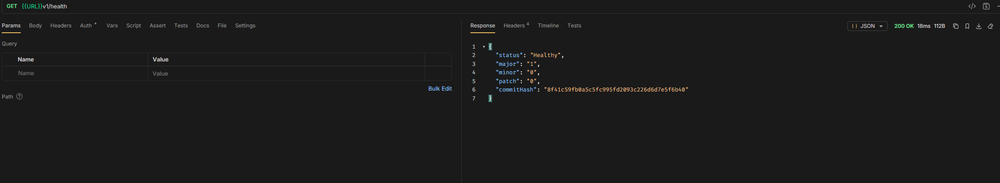
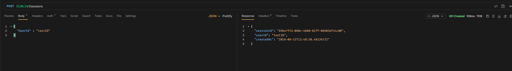
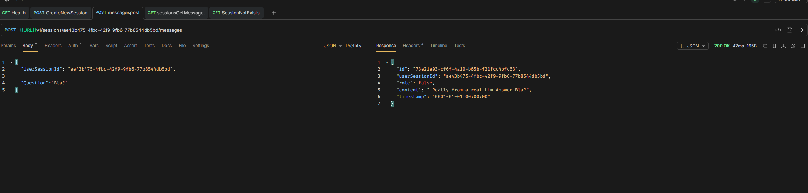
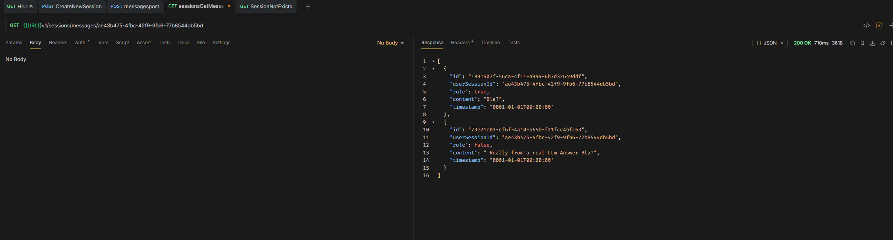
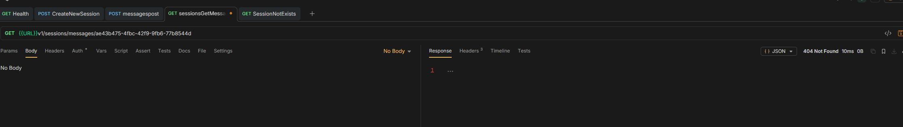
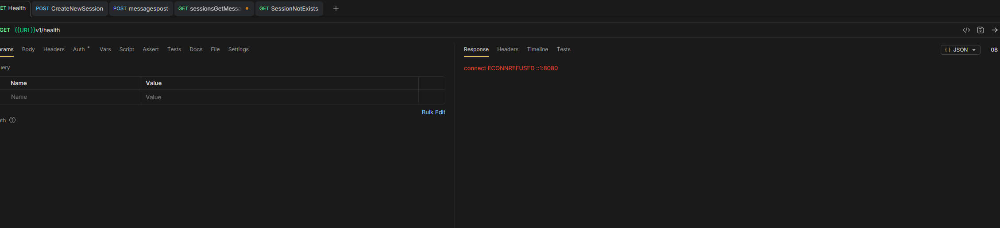
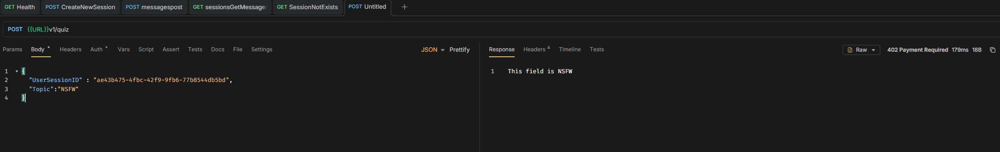

## Happy Path

Healty?


Create Session


Send Message in Session


Get all Messages from Session


## Errors

Trying to get messages from a session that does not exists


Port was not open Healty failed connecting




## Summary
Although we checked in our controllers for ModelValidity in {{URL}}v1/sessions/ae43b475-4fbc-42f9-9fb6-77b8544db5bd/messages that throws a "UnprocessableEntity" we get a 400 Bad Request as the .NET API checks already before our Model Check is even executed

``` json
{
  "type": "https://tools.ietf.org/html/rfc9110#section-15.5.1",
  "title": "One or more validation errors occurred.",
  "status": 400,
  "errors": {
    "request": [
      "The request field is required."
    ],
    "$.UserSessionId": [
      "The JSON value could not be converted to System.Guid. Path: $.UserSessionId | LineNumber: 1 | BytePositionInLine: 55."
    ]
  },
  "traceId": "00-f886b5703413539a810ae65b6e3e4cb9-9786618193d1ee26-00"
}
```

Otherwise our error were all expected.
We did not add useful messages to all Endpoints. The autogenerated ones where helpful.
