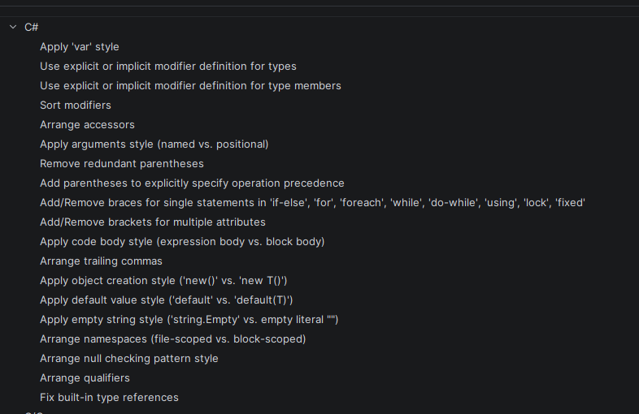

# Static Analysis

## Selected Categories & Tools
We have selected the following two categories to ensure the robustness of the ESBot server:

Dead Code / Logic: Since the project involves complex AI integration boundaries and multiple repositories, we need to ensure the codebase remains lean. Unused parameters often signal a "half-implemented" feature or a logic gap.
Style & Format Checkers: To ensure better readability and eliminate unproductive disussions about brackets, we set coding guidlines and style codes in our IDE. This also removes git diff noise.

## Category: Dead Code & Logic
Ensures that the codebase is free of unreachable paths and unused variables, reducing cognitive load for developers.

### Execution
This is performed using the native Roslyn Analyzers integrated into the .NET SDK. It is triggered during every compilation to provide immediate feedback.

```bash
dotnet build
```

Example Output:

``` csharp
Core net10.0 succeeded with 1 warning(s) (0,4s) → Core\bin\Debug\net10.0\Core.dll
  Infrastructure net10.0 succeeded with 4 warning(s) (0,5s) → Infrastructure\bin\Debug\net10.0\Infrastructure.dll
    P:\Hochschule\2026_SS_Software-Testing_esbot\EsBot-Server\Infrastructure\Infrastructure.csproj : warning NU1900: Error occurred while getting package vulnerability data: Unable to load the service index for source https://git.braincrush.org/api/packages/BraincrushProjects/nuget/index.json.
    P:\Hochschule\2026_SS_Software-Testing_esbot\EsBot-Server\Infrastructure\Infrastructure.csproj : warning NU1903: Package 'System.Security.Cryptography.Xml' 9.0.0 has a known high severity vulnerability, https://github.com/advisories/GHSA-37gx-xxp4-5rgx
    P:\Hochschule\2026_SS_Software-Testing_esbot\EsBot-Server\Infrastructure\Infrastructure.csproj : warning NU1903: Package 'System.Security.Cryptography.Xml' 9.0.0 has a known high severity vulnerability, https://github.com/advisories/GHSA-w3x6-4m5h-cxqf
    P:\Hochschule\2026_SS_Software-Testing_esbot\EsBot-Server\Infrastructure\Services\External\LlmInterface.cs(8,43): warning CS9113: Parameter 'quizRepository' is unread.
  API.Presentation net10.0 succeeded with 5 warning(s) (0,9s) → API.Presentation\bin\Debug\net10.0\API.Presentation.dll
  ```

### Setup & Configuration
We use a [.editorconfig](../../.editorconfig) file to define how the compiler should treat various code smells.
* **Ruleset:** Standard .NET recommended rules.
* **Enforcement:** Configured to treat specific logic issues as `Warnings` to prevent merging "dirty" code.

### Results & Evaluation
**Impact:** High.
**Example Found:** The tool flagged `warning CS9113: Parameter 'quizRepository' is unread`.
**Evaluation:** This was a real finding where a dependency was injected into the `LlmInterface` but never utilized. Removing it would simplifie the constructor and improved maintainability. It has near-zero overhead on development speed.

## Category: Style & Format Checkers
Maintains a consistent "single-voice" across the codebase to make code reviews more efficient.

### Execution
We use the .NET formatting tool which aligns with our [.editorconfig](../../.editorconfig) rules which are also visible in JetBrains  Rider:


```bash
# Check and fix formatting
dotnet format
```

### Setup & Configuration
* **Tool:** EditorConfig + JetBrains Rider.
* **Rules:** PascalCase for methods, file-scoped namespaces, and specific brace-placement rules are enforced to keep the C# code idiomatic.

### Results & Evaluation
**Impact:** Medium (Quality of Life).
**Evaluation:** By automating the formatting, we eliminated "diff noise" in Git. This allows the team to focus on logic changes during Peer Reviews rather than debating bracket placement or indentation.

## 4. Evaluation of Impact

### Usefulness for Code Quality
The static analysis immediately flagged a **High Severity Vulnerability** in our cryptography library. This is a "silent killer" that manual testing would never find. Additionally, catching unread parameters (Dead Code) prevents us from passing data into services (like `LlmInterface`) that isn't actually being utilized.

### Impact on Development Speed
Running these tools locally via `dotnet build` and `dotnet format` adds negligible overhead (approx. 0.5s–1.0s as seen in our logs). It provides immediate feedback, allowing us to fix security flaws *before* they are ever committed to the repository.

`Grammtic, translation and text structure improvements with ChatGPT Version 5.3 (24.04.2026 12:20)`
