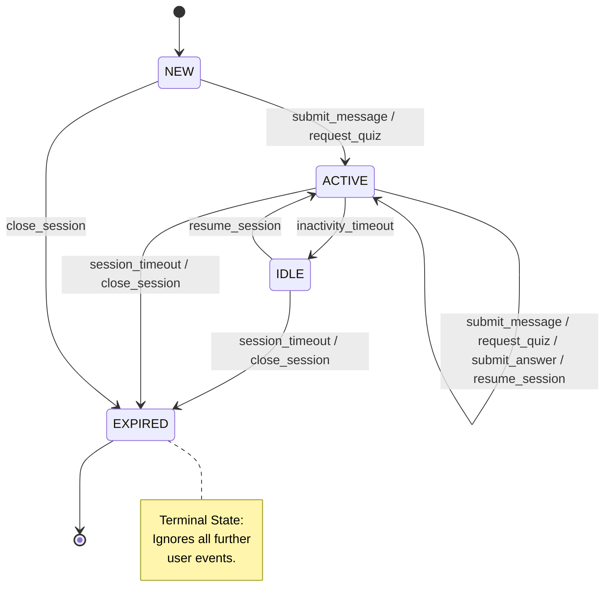

# 7
## Exercise 7.1: Black-Box Testing Techniques

## Step 1 and 2
### Parameter: `topic` (String)

**Rules:** 3–100 characters inclusive.

| Parameter | Class ID | Class Type | Partition Description | Representative Test Value |
| --- | --- | --- | --- | --- |
| `topic` | EC-T-1 | Valid | Length between 3 and 100 characters | "Software Testing" |
| `topic` | EC-T-2 | Invalid | Length too short (< 3) | "AI" |
| `topic` | EC-T-3 | Invalid | Length too long (> 100) | [101 'A' characters] |

**Justification & BVA:**

* **Justification:** "Software Testing" represents a standard academic topic. The invalid classes ensure the system rejects snippets or overly bloated inputs that could strain the LLM context.
* **BVA (Min):** 2 (Invalid), 3 (Valid - Bound), 4 (Valid).
* **BVA (Max):** 99 (Valid), 100 (Valid - Bound), 101 (Invalid).
* **Requirement:** Maps to **FR-3** (Quiz Generation) and **NFR-5** (Input Validation).

#### Parameter: `count` (Integer)

| Parameter | Class ID | Class Type | Partition Description | Representative Test Value |
|-----------|----------|------------|-----------------------|--------------------------|
| `count` | EC-C-1 | Valid | [1, 10] If the number is between (and including) 1 and 10, it is valid | 3 |
| `count` | EC-C-2 | Invalid | (-inf, 1) If the number is smaller than 1, it is invalid | -12 |
| `count` | EC-C-3 | Invalid | (10, inf) If the number is higher than 10, it is invalid | 43 |

**Justification & BVA:**
EC-C-1:
1. The representative value `3` is valid because it is an integer within the allowed range from 1 to 10.
2. This equivalence class contains all valid input values for the parameter. The derived boundary values are:
   * Lower boundary: `0`, `1`, `2`
   * Upper boundary: `9`, `10`, `11`
3. This class maps to **FR-3 (Exercise Generation)**, because the system must generate quiz questions only when the requested question count is within the valid range.

EC-C-2:
1. The representative value `-12` is a valid representative because every integer smaller than `1` belongs to the same invalid partition and should be rejected in the same way.
2. This class is associated with the lower boundary of the valid interval. Relevant boundary values are:
   * `0` (just outside the valid range)
   * `1` (valid lower boundary)
   * `2` (inside the valid range)
3. This class maps to **FR-3 (Exercise Generation)** and **NFR-5 (Security / Input Validation)**, because the system must reject invalid question counts below the minimum allowed value.

EC-C-3:
1. The representative value `43` is a valid representative because every integer greater than `10` belongs to the same invalid partition and should be rejected in the same way.
2. This class is associated with the upper boundary of the valid interval. Relevant boundary values are:
   * `9` (inside the valid range)
   * `10` (valid upper boundary)
   * `11` (just outside the valid range)
3. This class maps to **FR-3 (Exercise Generation)** and **NFR-5 (Security / Input Validation)**, because the system must reject question counts above the maximum allowed value.

#### Parameter: `difficulty` (String)

| Parameter | Class ID | Class Type | Partition Description | Representative Test Value |
|-----------|----------|------------|-----------------------|--------------------------|
| ``difficulty`` | EC-D-1 | Valid | The value is easy | ``easy``|
| `difficulty` | EC-D-2 | Valid | The value is medium | ``medium`` |
| `difficulty` | EC-D-3 | Valid | The value is hard | ``hard``|
| `difficulty` | EC-D-4 | Invalid | The value is an empty string | " " |
| `difficulty` | EC-D-5 | Invalid | The value is null | ``null``|
| `difficulty` | EC-D-6 | Invalid | The value is any other string | ``very hard`` |

**Justification:**

* Since this is a discrete set, ``Boundary Value Analysis`` does not apply. Testing "medium" validates the standard case, while "very hard" ensures the system doesn't default to an unhandled state.
* **Requirement:** Maps to **FR-3**.

## Step 3

|Numbering | Answer correctness | Answer is empty or blank | Quiz item stille exists in session | expected action |
| --- | --- | --- | --- | --- |
|1| - | Yes | - | no Answer error |
|2| - | - | No | no Quiz Item in Session error |
|3| Correct | No | Yes| Positive Feedback |
|4| Partially correct | No | Yes | Partly Positive Feedback with Correctness hints |
|5| Incorrect | No | Yes | Negative Feedback with Solutionexplanation |

1
> Empty Input Edge case

2
> No Quiz Started Edge case

3/4/5
> FR-004: System MUST evaluate user responses to quiz questions and provide feedback on correctness and areas for improvement.

## Exercise 7.2: State Transition Testing

### Step 1: State Transition Diagram

### Step 2: State Transition Table

| Current State | Event | Next State | Output / Action |
| --- | --- | --- | --- |
| `NEW` | `submit_message` | `ACTIVE` | Message accepted; LLM stream starts |
| `NEW` | `request_quiz` | `ACTIVE` | Message accepted; LLM stream starts |
| `ACTIVE` | `submit_answer` | `ACTIVE` | Evaluation provided (FR-4) |
| `ACTIVE` | `submit_message` | `ACTIVE` | Evaluation provided (FR-4) |
| `ACTIVE` | `request_quiz` | `ACTIVE` | Evaluation provided (FR-4) |
| `ACTIVE` | `resume_session` | `ACTIVE` | Evaluation provided (FR-4) |
| `ACTIVE` | `inactivity_timeout` | `IDLE` | Session context swapped to disk |
| `ACTIVE` | `session_timeout` | `EXPIRED` | Session timout Messsage |
| `IDLE` | `resume_session` | `ACTIVE` | Context reloaded to memory |
| `IDLE` | `session_timeout` | `EXPIRED` | Database record marked closed |
| `ANY` | `close_session` | `EXPIRED` | "Goodbye" message; clean up resources |
| `EXPIRED` | `ANY User Event` | `–` (Invalid) | Return Error: "Session Expired" (NFR-3) |

### Step 3: Test Case Derivation (All-Transitions Coverage)

**Sequence 1: Happy Path to IDLE**

* **Start:** `NEW`
* **Events:** `request_quiz` $\rightarrow$ `submit_answer` $\rightarrow$ `inactivity_timeout` $\rightarrow$ `resume_session`
* **Expected:** NEW $\rightarrow$ ACTIVE $\rightarrow$ ACTIVE $\rightarrow$ IDLE $\rightarrow$ ACTIVE.
* **Requirement:** FR-5, FR-3.

**Sequence 2: Forced Expiration**

* **Start:** `NEW`
* **Events:** `submit_message` $\rightarrow$ `close_session`
* **Expected:** NEW $\rightarrow$ ACTIVE $\rightarrow$ EXPIRED.
* **Requirement:** FR-1, FR-5.

**Sequence 3: Invalid Interaction (Negative Test)**

* **Start:** `EXPIRED`
* **Events:** `submit_message`
* **Expected:** System stays in `EXPIRED`. Returns user-friendly error (NFR-3).

## Exercise 7.3: Reflection

### 1. Complementarity

* **ECP/BVA:** Best for validating the **QuizRequest** API Parameters. Example: Ensuring `count` 11 is rejected, this can be checked with Boundary Validation checks. `difficulty`is easier to check with `Equivalence Class
Partitioning`.
* **Decision Tables:** Best for **Answer Evaluation** logic, where multiple boolean flags (empty, correct, exists) result in complex output rules.
* **State Transition:** Best for **Session Lifecycle**. Example: Verifying a user cannot submit an answer after a `session_timeout`.

### 2. Gaps

**Non-Deterministic Content:** None of these techniques effectively test the *pedagogical quality* or *hallucination rate* of the LLM (FR-2). Since the same prompt yields different text, we would need **Model-Based Testing** or **LLM-as-a-Judge** (using a second AI to grade the first).

### 3. Effort vs. Value

For ESBot, **ECP/BVA** provided the highest value relative to effort.
**Justification:** Because ESBot relies on external LLM providers (FR-8), sending invalid data (like a 10,000-character topic) can cause expensive API crashes or timeouts. Implementing BVA at the gateway (NFR-5) prevents these failures with very low design complexity.

Others like the State Transitions where a lot of effort for in this case small Value as the Transitions are very easy and intuitve to understand.
This can be very usefull in more complex systems.

`Grammtic,translation and sorting improvements with ChatGPT Version 5.3 (08.05.2026 15:45)`
