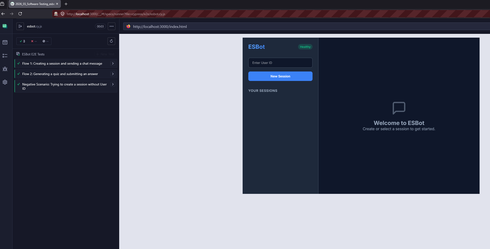

# E2E Testing with Cypress

This guide explains how to set up the environment and run end-to-end (E2E) tests using Cypress.
## Step 1
### 1. Setup

First, ensure you are in the root directory of the repository and install all necessary dependencies (which includes Cypress):

```bash
npm install
```

### 2. Start Everything

Before running the Cypress tests, you need to start the application.

**Start the Frontend:**
Open a terminal, navigate to the `frontend` folder, and start the local HTTP server on port 3000:

```bash
cd frontend
python -m http.server 3000
```

*(Note: If your E2E tests require the backend server, ensure the `EsBot-Server` .NET application is also running.)*

### 3. Running Cypress Tests

With the application running, open a **new terminal** in the **root folder** to run the tests.

#### Run in Headless Mode (Command Line only)
Headless mode executes all tests in the background without opening a browser window. This is ideal for CI/CD pipelines.

```bash
npm run test:e2e:cypress
```

*(This executes the `cypress run` command defined in `package.json`)*

#### Run with Head Mode (Interactive UI)
Head mode opens the Cypress Test Runner UI. This allows you to select specific tests, watch them execute in a browser, and use debugging tools.

```bash
npm run test:e2e:cypress:open
```

*(This executes the `cypress open` command defined in `package.json`)*


## Step 2



## Step 3
No Failing tests

`Grammtic, translation and text structure improvements with ChatGPT Version 5.3 (19.06.2026 12:20)`
